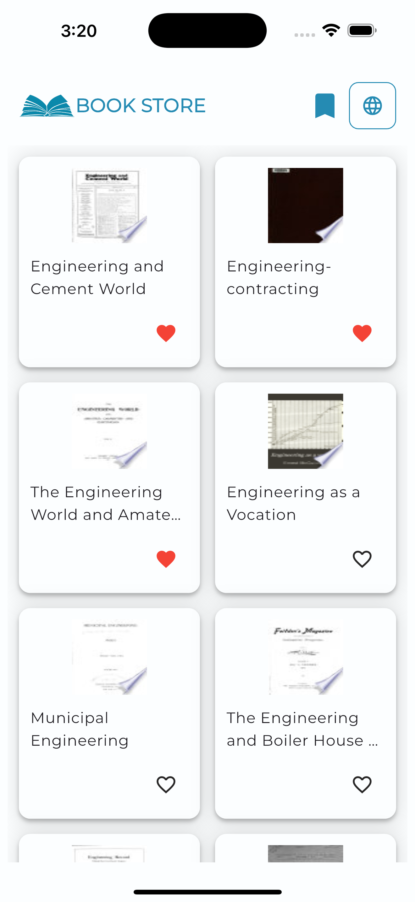
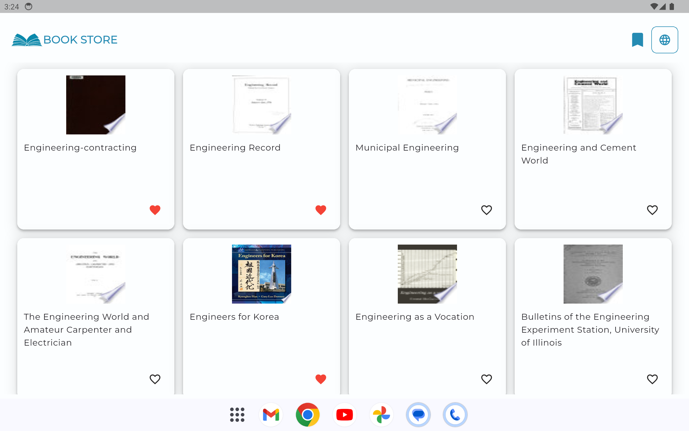
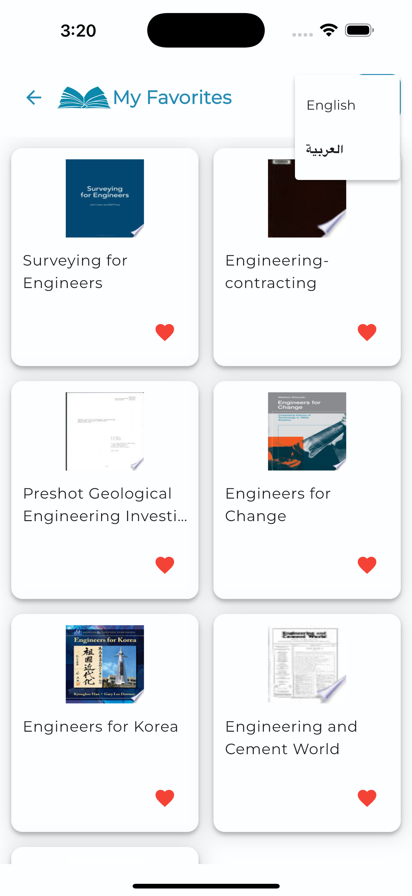
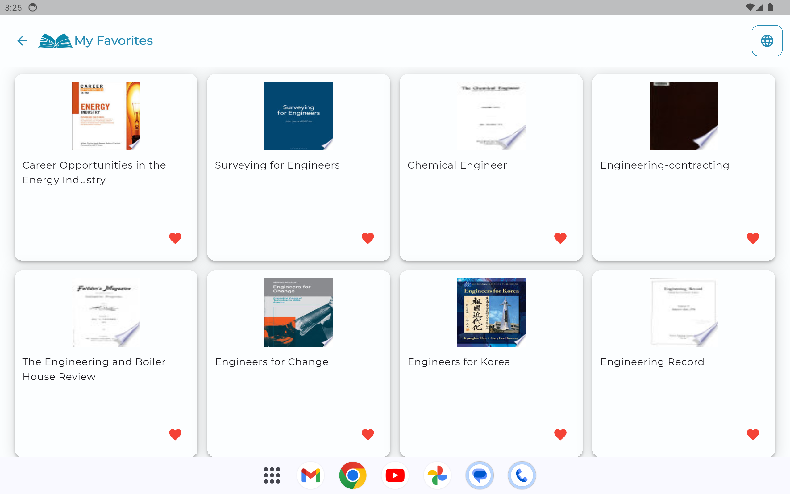

📚 Book Store App – Bloc & Cubit Edition
Overview
This repository contains an educational Flutter Book Store application built to explore and implement Bloc and Cubit for state management.
The project is based on a previous version that used Riverpod. In this edition, the core logic and architecture are being refactored to replace Riverpod with Bloc and Cubit, allowing a deeper understanding of event-driven state management and unidirectional data flow.

🎯 Purpose of This Project
This is an educational project created to:
* Practice implementing Bloc and Cubit in a real-world app structure
* Compare different state management approaches (Riverpod vs Bloc)
* Improve architectural decisions and code organization
* Strengthen understanding of scalable Flutter architecture
The UI and general structure are reused from the previous version, but the state management layer is being completely redesigned using Bloc and Cubit.

🏗 Architecture Focus
* Feature-based structure
* Clear separation of concerns
* Predictable state transitions
* Unidirectional data flow
* Improved testability

🔄 Migration Context
This project reuses the source code from the earlier Book Store app, replacing:
Riverpod ➝ Bloc / Cubit
The goal is not just to swap libraries, but to understand the architectural and philosophical differences between the two approaches.

🚀 Tech Stack
* Flutter
* Dart
* Bloc
* Cubit

📌 Status
Work in progress — this repository is actively being refactored and improved as part of the learning process.

## 📱 Screenshots

### Listing Page
| Mobile | Tablet |
|--------|--------|
|  |  |

### Favorites Page
| Mobile | Tablet |
|--------|--------|
|  |  |